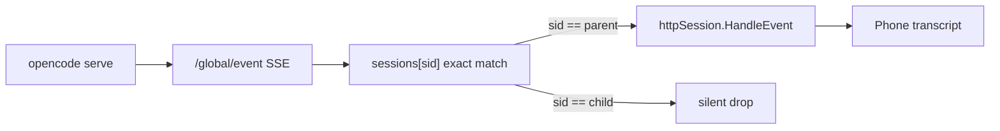
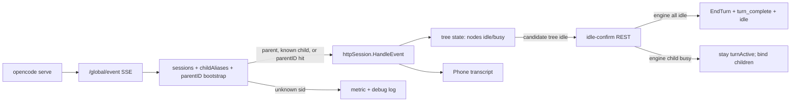

# MADR 0020: OpenCode session tree + async control plane

- **Status**: Proposed — **implementation in progress** (Sprint 1 P0 / PR1 landed in tree)
- **Date**: 2026-07-24
- **Last re-assessed**: 2026-07-24 (post ACP parity; mobile ACP UI follow-on)
- **Implementation notes**: PR1 transport tree hooks + demux bootstrap (see §0)
- **Deciders**: Project Owner (product acceptance); Implementer (daemon/provider);
  Mobile (transcript surface for questions / subagent cards)
- **Related**:
  - [MADR 0011](./0011-opencode-provider-plan.md) — OpenCode provider; HTTP path chosen as
    performance path, now exclusive
  - [MADR 0014](./0014-sse-reconnect-resync-decision.md) — SSE gap resync gates (H4);
    **must preserve and extend, not replace**
  - [MADR 0019](./0019-opencode-process-management-plan.md) — single `opencode serve`
    ownership; ACP path removed
  - [protocol-v1.md](./protocol-v1.md) — phone control plane (`plan`, permissions, status,
    modes/config for ACP agents)
  - [config.md](./config.md) — `providers.opencode.*`
  - [0021-opencode-http-api-coverage.md](./0021-opencode-http-api-coverage.md) — full REST/SSE
    coverage matrix (shipped / planned / gap / wontfix)

**Verified against** (initial draft): clean `master`, OpenCode **1.18.4**, SDK types under
`~/.config/opencode/node_modules/@opencode-ai/sdk/dist/{gen,v2/gen}/types.gen.d.ts`.

**Re-verified** (2026-07-24, HEAD including ACP work): `internal/provider/opencode/` and
`httpagent/` still match §1.3; no tree demux, tree-idle EndTurn, child permissions,
`ErrTurnBusy`, or `session_tree` flag. Grok ACP advanced separately (§1.5) and does
**not** substitute for this plan.

---

## 0. Implementation status (as of last re-assessment)

| Area | Status |
|---|---|
| MADR design + Owner Q1–Q6 | **Accepted product decisions**; design Proposed |
| Sprint 1 P0 **PR1** (aliases, bootstrap demux, tree Host hooks) | **Implemented** (httpagent + `sessionIDOf`/`ParentIDFromProps` + tree-aware `session.idle`) |
| Sprint 1 P0 PR2–PR3, PR5, PR7 | **Not started** (lifecycle events, resync tree, permission fan-in, `turn_busy`) |
| Sprint 1b questions | **Not started** |
| Sprint 2 todos → plan | **Not started** (`TypePlan` still **not** in `IsControl`) |
| Sprint 3 FIFO queue (Q1) | **Not started** |
| Parallel: Grok ACP protocol parity + mobile UI | **Shipped** — see §1.5 |

**Plan validity:** full re-assessment concluded the root cause, key decisions, and PR
order remain correct. No redesign required. Small plan adjustments only (§14 notes,
§1.5 reuse patterns).

---

## 1. Context / Problem

### 1.1 Product owner statement

> "the opencode support functionality pretty much sucks. it stops mid task. it loses
> its place during multi-stage runs. it doesn't use subagents or if it does, they
> fail. if we are going to support the opencode cli it needs to work and right now
> it does not."

### 1.2 What is already solid

Architecture after MADR 0019 is correct for process management and transport:

| Layer | Status | Where |
|---|---|---|
| Single long-lived `opencode serve` | Done (0019) | `internal/provider/httpagent/provider.go` |
| `POST /session/{id}/prompt_async` + `/global/event` SSE | Done | `internal/provider/opencode/http.go` |
| Model pinning at create + prompt | Done | `httpSession.Create` / `Prompt` |
| SSE reconnect resync (parent turn-end) | Done (0014) | `httpSession.Resync`, `session.resync`, reconnect hook |
| Part text delta + snapshot catch-up | Done (M8/M9) | `message.part.delta` / `updated` |
| Permission v1 asked/replied on **parent** sid only | Partial | `permission.asked` / `permission.replied` |

The failure mode is not "engine dies" or "SSE reconnect stuck forever" for the
parent-only case. It is a **dialect/control-plane mismatch** with OpenCode's real
runtime model.

### 1.3 Root cause (verified in code)

OpenCode 1.18+ is a **session tree**: a user-facing parent session may spawn child
sessions (subagents). Events for children carry the **child** `sessionID`. Child
sessions advertise `parentID` on `session.created` / `session.updated`.

Our demux is a **thin exact-id filter**:

```go
// internal/provider/httpagent/provider.go — streamOnce (simplified)
if typ, props, sid, ok := p.dialect.DecodeFrame(...); ok && sid != "" {
    s := p.sessions[sid]
    // generation stale check omitted
    if s != nil {
        s.dispatch(typ, props)
    }
    // else: frame silently discarded — no metric today
}
// Frames with empty sid are skipped entirely (ok && sid != "" gate).
// sessionIDOf today only checks sessionID / part.sessionID / info.sessionID —
// not info.id — so session.created {info:{id,parentID}} yields sid=="" and is dropped.
```

Only the parent agent id is registered (`register` on `Start`). **Every child-session
frame is dropped.** That alone explains:

1. Subagent work is invisible on the phone.
2. Child `permission.asked` / `question.asked` never reach the user → agent blocks
   until engine-side timeout → multi-stage run "stops mid task".
3. Parent `session.idle` is treated as turn-end even when children are still busy
   (`HandleEvent` → `session.idle` → `Host.EndTurn()` immediately). The phone shows
   idle / accepts a new prompt while OpenCode is still running the tree — or the
   reverse: parent stays "busy" in some edge cases after a missed child lifecycle.

Additionally, the dialect ignores a large slice of the OpenCode 1.18 event
vocabulary (verified against SDK types for 1.18.x):

| Handled today (`http.go` `HandleEvent`) | Ignored (engine emits) |
|---|---|
| `message.updated`, `message.part.delta`, `message.part.updated` | `session.created`, `session.updated`, `session.deleted` |
| `permission.asked`, `permission.replied` | `permission.v2.*`, `permission.updated` |
| `session.idle`, `session.error` | `session.status` (`busy` / `idle` / `retry`) |
| | `todo.updated` |
| | `question.asked` / `replied` / `rejected` (+ `question.v2.*`) |
| | `session.diff`, `session.compacted` |
| | entire child-session event trees |

`event.TypePlan` already exists and is rendered on mobile (ACP grok path maps plan
updates). OpenCode emits `todo.updated` with the same replace-semantics shape —
we never map it.

Second-prompt while busy already returns `prompt already in progress`
(`session.Prompt`) — not a silent drop — but there is no queue and no structured
error code for the phone to present cleanly.

### 1.4 Why this is urgent now

MADR 0019 removed the ACP escape hatch. OpenCode is HTTP-only. Multi-agent and
todo-driven workflows are table stakes for "opencode support works". Shipping a
single-session event filter against a tree runtime will keep failing the product
bar no matter how solid process ownership is.

### 1.5 Parallel work: Grok ACP parity (does not fix OpenCode)

After this MADR was committed, the daemon closed ACP protocol parity gaps for
**Grok** (and any future ACP agent):

| Change | Where | Relevance to OpenCode 0020 |
|---|---|---|
| Image/audio prompt content (`provider.Content` MimeType/Data) | acpagent, manager, protocol | OpenCode `Prompt` still maps **text only** — out of Sprint 1–3 scope unless product asks |
| `usage_update` → `event.TypeUsage` | acpagent | OpenCode HTTP dialect does not emit usage yet |
| Session modes + `session.set_mode` (`ModeSession`) | acpagent, WS | ACP-only; optional-interface **pattern** for Sprint 1b `QuestionSession` |
| Session config options + `session.set_config_option` (`ConfigSession`) | acpagent, WS | Same pattern |
| MCP servers + auth method in config | config, daemon, acpagent | Grok/ACP only |
| `TypeMode` / `TypeSessionConfig` in `IsControl` | `event.IsControl` | Good precedent; **`TypePlan` still droppable** under back-pressure |

**Explicit non-overlap:** these commits did not add child aliases, parentID
bootstrap, tree-idle EndTurn, permission origin routing, questions, todos, or
`turn_busy`. MADR 0019 still holds — OpenCode stays on the shared HTTP engine;
this document does **not** reintroduce OpenCode ACP.

**Reuse for implementers:**

1. **Sprint 1b `QuestionSession`** — optional interface + manager type-assert + WS
   handler + ownership checks, mirroring `ModeSession` / `ConfigSession`.
2. **`TypePlan` ∈ `IsControl`** — one-line shared fix; safe anytime (benefits Grok
   plan delivery today and OpenCode todos in Sprint 2). Prefer landing with PR6
   or as a tiny pre-PR; do not block Sprint 1 P0 on it.
3. **Image/audio on OpenCode** — orthogonal; do not fold into tree PRs.

---

## 2. Decision

1. **Treat OpenCode turns as a session tree, not a single session id.** The daemon
   registers **child aliases** under the parent local session and fans child SSE
   into that session's dialect adapter. Bootstrap demux via `parentID` is required
   so the first `session.created` is not dropped (§6.1).
2. **End a turn only when the tree is idle** (parent + known children), not on the
   first parent `session.idle`. Before EndTurn when the tree is empty/partial,
   **confirm via one-shot REST** so a reordered create cannot false-end the turn
   and disable 0014 recovery (§6.3).
3. **Fan-in child (and v2) permissions** to the phone in Sprint 1 P0; answers route
   to the correct engine path. **Questions** are Sprint 1b (same product arc, not
   on the P0 critical path — see §14).
4. **Map `todo.updated` → existing `plan` events** (no new wire type for todos).
5. **Extend MADR 0014 resync** with children/status/todo REST reconciliation; keep
   all existing gates (`turnActive`, `!promptInFlight`, stale-evidence, finished-only).
6. **Preserve MADR 0019 invariants**: one engine per daemon, no ACP, no second process
   model.
7. **Minimal protocol expansion**: reuse `plan`, `permission_*`, `tool_*`,
   `session_status`, `notice`. Add **question** request/response types in Sprint 1b
   (answer shape is multi-select lists, not a single `option_id`). Subagent
   visibility reuses tool cards + optional notices in Sprint 1; richer cards later.
8. **Busy second prompts are queued (FIFO)** — Owner decision Q1 (2026-07-24).
   Sprint 1 P0 ships structured `turn_busy` only; Sprint 3 lands the queue (KD8,
   §14). Overflow / closed still returns `turn_busy`.

**Sprint 1 P0** (shippable alone, this document's primary implementable core)
delivers (1)–(2), permission fan-in (3 partial), tree-aware resync, and the
`turn_busy` bridge so missed child completion cannot stick a turn. **Sprint 1b**
completes questions (A2 full). **Sprint 3** delivers the FIFO prompt queue (8).
Sprints 2–5 are sequenced action rows with dependencies.

---

## 3. Goals & Non-Goals

### Goals (full multi-sprint arc)

| # | Goal |
|---|---|
| G1 | Subagent activity is visible live on the phone; turn ends cleanly when the **tree** is idle |
| G2 | Child permission (P0) or question (1b) blocks visibly and is answerable from the phone; answering unblocks |
| G3 | Todo lists (10+ steps) stay correct across SSE reconnect via REST resync |
| G4 | Missed parent **or child** turn-end recovers without `/reset` |
| G5 | Second prompt while busy is never a silent drop: **FIFO queue** (product path, Sprint 3); structured `turn_busy` interim (Sprint 1) and for overflow |
| G6 | Live suite green against installed OpenCode ≥ min pin (1.18.x) |

### Non-Goals

- Reintroducing OpenCode ACP (MADR 0019 stands).
- Full TUI parity (fork UI, compact UI, diff browser, `/command` palette) in Sprint 1 —
  those are Sprint 4–5.
- Replaying tool cards lost entirely inside an SSE gap (0014 accepted scope; still
  accepted for children unless it becomes a field complaint).
- Driving arbitrary non-OpenCode multi-session engines through the same tree
  machinery (hooks stay dialect-specific; alias registry is transport-generic).
- Changing mcrelay / pairing / TLS.

---

## 4. Key Decisions

| ID | Decision | Rationale |
|---|---|---|
| **KD1** | **Child alias registry on the transport** (`httpagent.Provider`), not separate daemon sessions | Children are OpenCode implementation details of one user conversation. Creating phone-visible sessions per child would explode the session list and break resume/history ownership. One local session id remains the transcript key. |
| **KD2** | **Tree-idle EndTurn + one-shot idle confirm REST** — parent `session.idle` alone is insufficient; empty/partial tree must confirm engine status before EndTurn | OpenCode can idle the parent while a subagent runs, or emit parent idle **before** `session.created`. A false EndTurn sets `turnActive=false`, which **disables** 0014 resync (gated on turn-active only) — the stall watchdog exits and recovery never runs. Confirm is not a healthy-stream poller (KD9). |
| **KD3** | **Fan-in child events into the same `DialectSession.HandleEvent`**, with `sessionID` recovered from props; **bootstrap demux via `parentID`** when aliases miss (`sessions[parentID] ?? childAliases[parentID]` for nested trees) | Avoids a second adapter per child. Without parentID bootstrap, first `session.created` can never bind (chicken-and-egg). Nested subagents resolve through mid-node aliases. |
| **KD4** | **Permission answers carry engine session id internally** (map `permissionID → agentSessionID`) | Today's `POST /session/{parent}/permissions/{id}` fails for child-owned permissions. Global `POST /permission/{requestID}/reply` (v2 SDK) is preferred when available; fall back to the session-scoped path with the **source** sid. |
| **KD5** | **Todos → `event.TypePlan`** (replace-semantics already documented) | Mobile already renders `plan`. OpenCode `cancelled` → keep entry with status `pending` and content prefix `"(cancelled) "` (not `completed` — false "done" misleads multi-step UX). See Q4 resolved. |
| **KD6** | **Questions get new protocol types** (`question_request` / `question_resolved` + `question.respond`) in **Sprint 1b**, via optional `provider.QuestionSession` (same pattern as ACP `ModeSession` / `ConfigSession` after parity commits) | Multi-question multi-select answers (`answers: string[][]` of **labels**) do not fit `permission.respond`. Not on Sprint 1 P0 critical path (permissions cover A2-permissions). Grok does not implement the interface. |
| **KD7** | **Subagent live activity reuses existing stream events** (text/tools) + synthetic `tool_call` (`tool_kind=other`, id `subagent:<agentID>`) | Avoids a new event type until Sprint 5. **Must** complete synthetic cards on tree EndTurn even if `session.deleted` was missed; clip titles (300). If tool noise is high, fall back to `notice` for lifecycle only. |
| **KD8** | **Busy second prompt: FIFO queue (Owner decision Q1).** Ship typed `provider.ErrTurnBusy` → WS `turn_busy` in Sprint 1 P0 as interim + overflow; Sprint 3 lands a per-session FIFO prompt queue as the product path. | Owner chose **queue** over error-only (2026-07-24). Queue rules (§14 Sprint 3): FIFO; never auto-dequeue while a permission/question is pending; never silent drop. `turn_busy` remains for queue-full / session closed / pre-queue Sprint 1. Lives on `provider` (not `session`) so transports do not import the manager package. |
| **KD9** | **No steady-state status poller** while SSE is healthy; REST only on resync, stall, and **idle-confirm before EndTurn** | Matches 0014's rejection of periodic polling. Idle-confirm is event-triggered and bounded (2–3s), not N-second polling. |
| **KD10** | **Min OpenCode version pin 1.18.x** (dev host verified 1.18.4); refuse or warn on older engines when tree features are required | Event + REST shapes below are from 1.18 SDK types. |
| **KD11** | **`providers.opencode.session_tree` kill switch restores exact pre-0020 behavior** | When false: no childAliases binds (ignore/disable), parent-only EndTurn (no idle-confirm tree REST), no child fan-in. Not a partial mode. Default `true` after Sprint 1 P0 tests green. |

---

## 5. Current vs target architecture

### 5.1 Today (single-session filter)



### 5.2 Target (tree demux + tree-idle)



### 5.3 Sequence — subagent turn with child permission

```mermaid
sequenceDiagram
  participant Phone
  participant Daemon as mcremote httpagent
  participant OC as opencode serve

  Phone->>Daemon: session.prompt
  Daemon->>OC: POST /session/{parent}/prompt_async
  OC-->>Daemon: session.status busy (parent)
  OC-->>Daemon: session.created info.parentID=parent
  Note over Daemon: bootstrap demux via parentID; bind childAlias
  OC-->>Daemon: message.part.* on child
  Daemon-->>Phone: assistant/tool events (parent session_id)
  OC-->>Daemon: permission.asked sessionID=child
  Daemon-->>Phone: permission_request
  Phone->>Daemon: permission.respond
  Daemon->>OC: POST /permission/{id}/reply (or session-scoped child path)
  OC-->>Daemon: permission.replied
  OC-->>Daemon: session.idle (child), session.idle (parent)
  Daemon->>OC: GET /session/status (idle-confirm if needed)
  Note over Daemon: tree idle confirmed → EndTurn
  Daemon-->>Phone: turn_complete + session_status idle
```

---

## 6. Detailed design (Sprint 1 implementable)

### 6.1 Transport: child alias registry + parentID bootstrap demux

**File**: `internal/provider/httpagent/provider.go`

Add alongside `sessions map[string]*session`:

```go
// childAliases maps OpenCode child agent-session ids → the parent *session
// that owns the user-visible transcript. Entries are created when the dialect
// observes session.created/updated with parentID equal to a registered
// agent id (or when Resync / idle-confirm discovers children via REST).
// Cleared on parent unregister / Close.
childAliases map[string]*session
```

#### 6.1.1 Chicken-and-egg (Sprint 1 hard requirement)

SDK v1 `session.created` is:

```ts
properties: { info: Session }  // Session.id, Session.parentID? — NO top-level sessionID
```

Bind happens **inside** `HandleEvent` after observing create. If demux only looks
up `sessions[sid]` / `childAliases[sid]` with `sid = info.id` (the **child**),
the first create frame **misses both maps**, is dropped, and `BindChildAlias`
never runs — all subsequent child frames also drop. Resync `GET .../children` is
a **backup**, not the primary live bind path.

#### 6.1.2 Demux algorithm (normative)

`streamOnce` already gates on `ok && sid != ""`. Full Sprint 1 demux:

```go
typ, props, sid, ok := p.dialect.DecodeFrame(data)
if !ok || sid == "" {
    return // empty sid: still skipped; sessionIDOf must return info.id for lifecycle
}
p.mu.Lock()
stale := p.generation != gen
s := p.sessions[sid]
if s == nil {
    s = p.childAliases[sid]
}
// Bootstrap: unresolved sid may be a brand-new child (or grandchild). Resolve
// via parentID extracted from props (info.parentID) without waiting for
// HandleEvent bind. Nested trees: parentID may itself be a child already
// aliased to a local *session — look up sessions first, then childAliases.
if s == nil {
    if parentID := parentIDOf(props); parentID != "" {
        owner := p.sessions[parentID]
        if owner == nil {
            owner = p.childAliases[parentID] // multi-level: mid-node is not in sessions
        }
        if owner != nil {
            s = owner
            // Eager alias so subsequent frames hit childAliases without
            // re-parsing parentID. Always points at the local *session that
            // owns the user transcript (grandchildren share the same owner).
            // HandleEvent still calls BindChildAlias (idempotent).
            p.childAliases[sid] = owner
        }
    }
}
p.mu.Unlock()
if stale {
    return
}
if s != nil {
    s.dispatch(typ, props)
} else {
    p.noteUnknownSID(sid, typ) // debug + metric; do not spam INFO
}
```

**Multi-level trees (depth > 1):** `Session.parentID` may name a mid-level child
already in `childAliases`, not a top-level `sessions` entry. Resolving
`sessions[parentID] ?? childAliases[parentID]` fans any depth into the same
local `*session`. Resync / idle-confirm must also walk children recursively
when binding (`GET /session/{id}/children` on parent, then on each discovered
child if non-empty) so a grandchild created only during a gap is still tree
members — see §6.3.1 / §6.7.

**Unit tests (required, PR1 or PR2)**:

- First frame for a **direct** child is only
  `session.created` with `{info:{id:"child1", parentID:"parent1"}}` — must dispatch
  to the parent session and leave `childAliases["child1"]` set. No prior bind.
- First frame for a **grandchild** with
  `{info:{id:"g1", parentID:"child1"}}` when `childAliases["child1"]` already
  points at the parent `*session` — must dispatch to that same session and set
  `childAliases["g1"]`.

`parentIDOf` / `sessionIDOf` live in the OpenCode dialect (or a shared props
helper used by `DecodeFrame`). Minimum `sessionIDOf` fix:

```go
// After sessionID / part.sessionID / info.sessionID probes:
if probe.Info.ID != "" { // json:"id" on Session
    return probe.Info.ID
}
```

`DecodeFrame` may also surface parentID if the transport prefers a richer
decode API later; Sprint 1 can keep `DecodeFrame` returning sid only and parse
`parentIDOf(props)` in the provider (props are already the event properties
blob). Prefer putting `parentIDOf` next to `sessionIDOf` in `opencode/http.go`
and exporting a small `httpagent` hook, **or** having the dialect implement an
optional `FrameParentID(props) string` interface so the transport stays
engine-agnostic:

```go
// Optional on Dialect:
// ParentIDFromProps returns the parent agent session id for a frame that
// introduces a child (session.created/updated), or "".
type ChildFrame interface {
    ParentIDFromProps(props json.RawMessage) string
}
```

#### 6.1.3 Provider API

| Method | Behavior |
|---|---|
| `bindChild(childID, parent *session)` | Insert alias; no-op if already bound to same parent; reject if bound to a different live parent |
| `unbindChild(childID, parent *session)` | Delete only if owner matches (same identity check as `unregister`) |
| `unbindAllChildren(parent *session)` | On parent `Close` / `unregister` |
| `childrenOf(parent *session) []string` | Snapshot for resync / tests |

**Concurrency**: same `p.mu` as `sessions`. Alias insert must not run with the
mutex held across REST — only map ops under lock.

**Register identity rules** (extend existing M13 tests):

- Parent `register` unchanged (reject duplicate parent agent id).
- A child id must never equal another parent's agent id in `sessions`.
- If OpenCode reuses a child id after delete (unlikely), `session.deleted` /
  `unbind` clears first; a later `created` rebinds.
- When `session_tree` flag is false (KD11): skip bootstrap bind and ignore
  `BindChildAlias` (no-op).

### 6.2 Host surface extensions

**File**: `internal/provider/httpagent/httpagent.go` (`Host` interface)

Sprint 1 additions (minimal):

```go
// BindChildAlias routes SSE for childAgentID to this host's session.
// parentAgentID must equal Host.AgentSessionID(); dialects call this when they
// observe session.created/updated with that parentID, or when Resync lists children.
BindChildAlias(childAgentID string)

// UnbindChildAlias drops a child route (session.deleted, or tree cleanup).
UnbindChildAlias(childAgentID string)

// NoteNodeStatus records busy/idle/retry for agentSessionID (parent or child)
// for tree-idle EndTurn. Empty agentSessionID means the parent.
NoteNodeStatus(agentSessionID string, status NodeStatus)

// TryEndTurnIfTreeIdle ends the turn iff every *known* tree node is idle, the
// turn is still active, and (for OpenCode / session_tree) idle-confirm REST
// agrees the engine tree is idle. Returns whether EndTurn fired.
// Dialects call this from session.idle / session.status instead of bare EndTurn.
// For non-tree dialects (no binds, flag off): equivalent to EndTurn when the
// only node is the parent (confirm may no-op if dialect has no confirm hook).
TryEndTurnIfTreeIdle() bool

// TrackPermissionOrigin records which agent session owns a permission id so
// RespondPermission can address the correct REST path.
TrackPermissionOrigin(permissionID, agentSessionID string)
```

`NodeStatus` is a small transport enum: `idle`, `busy`, `retry` (retry counts as
busy for EndTurn purposes).

**Why on Host, not only dialect-private state?** Resync, stall watchdog, idle
confirm, and permission expiry live in `session`; they need tree visibility
without importing OpenCode types into the transport.

**Default for non-OpenCode dialects**: if a dialect never calls
`BindChildAlias` / `NoteNodeStatus`, `TryEndTurnIfTreeIdle` degenerates to
parent-only `EndTurn` — no behavior change for hypothetical single-session engines.

#### 6.2.1 Concurrency / re-entrancy invariants

| Invariant | Rule |
|---|---|
| Lock scope | `treeNodes`, `turnActive`, `promptInFlight`, `turnStartedAt`, `permOrigin`, `pending` mutate **only under `s.mu`**. |
| EndTurn path | For OpenCode tree mode, idle/status use **only** `TryEndTurnIfTreeIdle` (not bare `EndTurn`). Parent `session.error` may call `EndTurn` after marking nodes idle (terminal). `EndTurn` stays **idempotent** (returns whether a turn was active). |
| Emit ordering | Compute end decision under `s.mu`, clear `turnActive`, **release lock**, then `Emit` `turn_complete` / `session_status` (control emits can block; must not hold `s.mu`). Same pattern as today's control delivery. |
| Concurrent status | Child `NoteNodeStatus(busy)` under lock after a false candidate end check must win: re-check tree under the same critical section before clearing `turnActive`. |
| REST | Idle-confirm and Resync **must not** hold `s.mu` or `p.mu` across HTTP. Snapshot agent ids under lock, fetch, then re-apply status under lock and re-evaluate EndTurn. |
| Double EndTurn | Second `TryEndTurnIfTreeIdle` after `turnActive=false` is a no-op (idempotent). |

### 6.3 Session turn state (tree-aware)

**File**: `internal/provider/httpagent/session.go`

Extend `session` fields (under `s.mu`):

```go
// treeNodes tracks liveness of parent + children for EndTurn.
// Key: agent session id; parent uses s.agentID.
treeNodes map[string]nodeState // status + lastTransition

// permOrigin maps permission id → agent session id that asked.
permOrigin map[string]string

// confirmInFlight prevents stacked idle-confirm REST calls for one session.
confirmInFlight bool
```

**Turn claim** (`Prompt`): unchanged gates (`turnActive`, `promptInFlight`,
`turnStartedAt`). On successful enqueue, set parent node to `busy`. Return
`provider.ErrTurnBusy` when already active — see §7.2.1.

**EndTurn paths**:

| Trigger | Today | Sprint 1 |
|---|---|---|
| `session.idle` (parent) | `EndTurn()` immediately | `NoteNodeStatus(parent, idle)` → `TryEndTurnIfTreeIdle()` (may REST-confirm) |
| `session.idle` (child) | dropped | `NoteNodeStatus(child, idle)` → `TryEndTurnIfTreeIdle()` |
| `session.status` busy/retry | ignored | `NoteNodeStatus(..., busy/retry)` — never EndTurn |
| `session.status` idle | ignored | same as `session.idle` for that node |
| `session.error` (parent) | `EndTurn` + error events | keep; mark parent idle; force tree end (error is terminal for the turn) |
| `session.error` (child) | dropped | emit error/notice on parent transcript; mark child idle; do **not** force whole-tree EndTurn (Q3: isolate) |
| Resync (0014) | parent message log finished → `EndTurn` | parent finished **and** all children idle (REST) → `EndTurn`; see §6.7 |
| User Cancel | parent abort only | parent abort + **best-effort child abort** if status still busy (§6.9, A7) |

#### 6.3.1 Race: parent idle before children known (critical)

OpenCode may emit parent `session.idle` **before** (or without a yet-observed)
`session.created` for a live subagent. If the daemon EndTurns on “parent idle +
no known children”:

1. `turnActive=false`, phone gets `turn_complete` + idle.
2. Stall watchdog exits (`!turnActive`).
3. **0014 resync cannot recover** — `session.resync` is gated on `turnActive`
   only (`httpagent/session.go`). The phone is idle while the engine tree is
   still busy; the next prompt races the engine.

This is **not** the same residual class as “child created and completed entirely
inside an SSE gap.” Live reordering of create vs parent idle is expected.

**Normative mitigation — one-shot idle confirm (KD2 / KD9):**

On every `TryEndTurnIfTreeIdle` candidate where `turnActive` and all *known*
nodes are idle (including the common case: only parent known and parent idle):

**Critical: tree membership is per local session, not engine-global.** One
`opencode serve` hosts many concurrent local sessions (`Provider.sessions` is
multi-key). SDK `GET /session/status` returns a **global** map
`{ [sessionID]: SessionStatus }` covering every engine session (other phone
chats, orphans, etc.). Interpreting “any busy key in the map” as “this tree is
busy” causes:

- **False stay-active**: another session is `busy` → this turn never EndTurns.
- **False bind**: treating foreign status keys as children pollutes
  `childAliases` / `treeNodes`.

**Tree membership algorithm (normative):**

```text
// Under lock (snapshot only):
parentID := s.agentID
known   := childrenOf(s)           // from childAliases owned by this *session
treeIDs := { parentID } ∪ known

// Without locks — bounded REST (2–3s total):
listed  := GET /session/{parentID}/children   // direct children of THIS parent
// Optional depth > 1: for each id in listed, GET .../children and union (bounded BFS)
treeIDs  = treeIDs ∪ { c.id for c in listed } ∪ recursive children if used
statusMap := GET /session/status              // GLOBAL map — do not iterate as tree

// Relevance filter — ONLY keys in treeIDs:
for id in treeIDs:
    st := statusMap[id]   // missing key → treat as idle (or re-fetch children only)
    apply NoteNodeStatus(id, st)
    if st is busy|retry → treeBusy = true

// Bind only ids discovered as children of THIS parent (listed / recursive),
// never every key in statusMap.
for c in listed (+ recursive if used):
    BindChildAlias(c.id)  // owner = this *session

// Under lock again:
if treeBusy → do not EndTurn; return false
if all treeIDs idle (or status/children 404 on old engines / flag off) → EndTurn(); return true
```

**Hard rules:**

1. `treeIDs = {parent} ∪ existing aliases for this *session ∪ GET .../children`
   (recursive only if multi-level is in scope — Sprint 1 includes nested
   bootstrap via `childAliases` lookup; recursive REST is recommended when
   children lists are non-empty).
2. Status is a **liveness oracle for `treeIDs` only** — ignore all other map keys.
3. Never `BindChildAlias` an id solely because it appears busy in the global
   status map.
4. Singleflight: if `confirmInFlight`, do not stack another confirm; the in-flight
   call re-evaluates when it finishes.
5. Snapshot under lock; REST without locks; re-apply under lock before EndTurn
   (same as §6.2.1).
6. Implementation may run confirm on the SSE goroutine or a session-owned
   goroutine; either is fine if tests cover the cases below.

**When confirm may be skipped** (optimization, optional): known children of
**this** tree exist and at least one is still marked busy — already no EndTurn,
no REST needed. Confirm is **required** when the candidate would EndTurn with
zero children or all known nodes idle (engine may know more than we do).

**Residual false EndTurn** only remains for: child created and completed entirely
inside a gap **and** confirm REST already shows empty/idle for **this** tree
**and** parent message log finished — acceptable (same class as 0014 tool-gap).

**Unit tests (required)**:

- parent idle, no aliases, REST children+status show **this** tree’s child busy →
  stay `turnActive`, bind that child.
- parent idle, no aliases, this tree all idle → EndTurn once.
- parent idle, known child busy → no REST required, no EndTurn.
- **Multi-session isolation**: two registered parents A and B; global status shows
  B busy and A idle with empty children → idle-confirm on A **EndTurns**; does
  **not** bind B’s id; does **not** stay active because of B.
- after false EndTurn path is fixed: resync still recovers missed idle when
  turn stayed active with busy child in **this** tree.

### 6.4 OpenCode dialect event expansion

**File**: `internal/provider/opencode/http.go` — `HandleEvent`

#### 6.4.1 Session lifecycle

```text
session.created / session.updated
  props: { info: Session }  // v1 SDK
       or { sessionID, info: Session }  // v2 envelope variants
  Session.parentID?: string
  Session.id, Session.title, Session.agent?
```

Logic:

1. Resolve `info.ID` / `info.id` and `info.ParentID` (bootstrap demux may already
   have aliased; `BindChildAlias` is idempotent).
2. If `parentID == o.h.AgentSessionID()` **or** `parentID` is already a known
   child alias of this host (nested tree) → `o.h.BindChildAlias(id)`; emit a
   lifecycle card (KD7):
   - `tool_call` with `tool_id = "subagent:"+id`, `tool_name = title or agent or "subagent"`,
     `tool_kind = "other"`, `status = "running"`, `text = clip(title, 300)`.
3. If event is for a known child or parent, `NoteNodeStatus` only when status
   fields exist (created alone does not imply busy — but prefer
   `NoteNodeStatus(child, busy)` when a child is first bound during an active
   parent turn so tree-idle does not race).

```text
session.deleted
  → UnbindChildAlias; tool_call_update status=completed for synthetic card
```

On **tree EndTurn** (wherever it fires): complete any still-running synthetic
subagent cards (`tool_call_update` `status=completed`) so a missed
`session.deleted` does not leave spinners (KD7).

#### 6.4.2 Status / idle / error

```text
session.status
  properties: { sessionID, status: {type: idle|busy|retry, ...} }
  → NoteNodeStatus
  → if type==retry: Emit TypeNotice with attempt/message/next (clip 300)
  → if type==busy for parent: ensure session_status "running" (dedupe if already)

session.idle
  properties: { sessionID }
  → NoteNodeStatus(sid, idle)
  → if TryEndTurnIfTreeIdle(): turnCleanup; complete synthetic subagent cards;
    emit turn_complete + session_status idle (same event order as today).
    Note: TryEndTurnIfTreeIdle may perform idle-confirm REST (§6.3.1).

session.error
  → existing classification for parent
  → for child: TypeError or TypeNotice with prefix "subagent: "; NoteNodeStatus idle;
    TryEndTurnIfTreeIdle only if parent also idle (do not orphan a live parent)
```

**Critical**: remove the bare `o.h.EndTurn()` on `session.idle` without tree check
and without idle-confirm.

#### 6.4.3 Message / parts on children

Reuse existing `message.*` handling unchanged. Events already demuxed to the
parent session; text and tools appear in the same transcript. Optional Sprint 1
polish: prefix tool names with child title when `sessionID != parent` (requires
passing sid into HandleEvent — see §6.4.7).

#### 6.4.4 Permissions — v1 + v2 fan-in (Sprint 1 P0)

**Runtime event type strings** (handle all; one **logical** mapper after normalize):

```text
permission.asked          // live 1.18.4 path (existing code + live tests)
permission.updated        // v1 SDK EventPermissionUpdated — different JSON shape
permission.replied
permission.v2.asked
permission.v2.replied
```

**Event name is not a field-shape alias.** SDK shapes differ (verified
`@opencode-ai/sdk` gen types):

| Field role | `permission.asked` (v2-style) | `permission.updated` (v1 `Permission`) |
|---|---|---|
| Request id | `id` | `id` |
| Session | `sessionID` | `sessionID` |
| Action / name | `permission` (string) | `type` (string) |
| Patterns | `patterns: string[]` | `pattern?: string \| string[]` |
| Always options | `always: string[]` | absent |
| Title / detail | metadata / patterns | `title` + metadata |
| Tool link | `tool?: {messageID, callID}` | `messageID`, `callID?` |

Unmarshaling `permission.updated` into the asked struct **drops** `type` /
`pattern` / `title` and can yield empty `tool_name` / `text`. **Required:** a
shared normalizer that probes both shapes before emitting `permission_request`:

```go
// Pseudo — one internal struct after normalize:
type permAsk struct {
    ID, SessionID, Name, Detail string
    Patterns, Always []string
    // ...
}

func normalizePermissionAsk(props json.RawMessage) (permAsk, bool) {
    // Probe loosely (json.RawMessage + map or dual structs):
    //   id, sessionID always
    //   name  = firstNonEmpty(permission, type)
    //   patterns = patterns OR coerce pattern string|[]string → []string
    //   detail = join(patterns) OR title OR shortJSON(metadata)
    //   always = always (empty for updated → no "Allow always" option unless present)
}
```

Switch:

```go
case "permission.asked", "permission.updated":
    p, ok := normalizePermissionAsk(props)
    // TrackPermission + TrackPermissionOrigin + Emit permission_request
case "permission.v2.asked":
    // map action → Name, resources → Patterns/Detail, save → Always
```

Dedupe on request id in `pending` so dual emission of asked+updated cannot
double-sheet. PR8 / live fixtures should capture whichever type string 1.18.4
actually emits; **both** field maps remain handled.

**permission.replied**:

```text
{ sessionID, requestID | permissionID, reply | response }
```

Changes:

1. `TrackPermission(id)` **and** `TrackPermissionOrigin(id, sessionID or parent)`.
2. `RespondPermission` uses origin map:

```go
// Prefer global v2-style reply when engine supports it (OpenCode 1.18+):
//   POST /permission/{requestID}/reply  body: { reply: once|always|reject }
// Fallback (current):
//   POST /session/{originSessionID}/permissions/{permissionID}
//     body: { response: once|always|reject }
```

Recommend **prefer global `/permission/{id}/reply`** for all permissions — works
for parent and child; session-scoped fallback on 404.

3. Child permissions: same `permission_request` event to the phone (`session_id` =
   **local** parent id). No phone-visible child id required for Sprint 1.

**v2 asked** map to the same UI:

- `tool_name` ← `action`
- `text` ← join `resources` + short metadata
- options: once / always (if `save` non-empty) / reject

**Pending resync** (`GET /permission`): owned by **PR5** resync composition (§6.7),
not PR3. PR3 only does live fan-in + origin routing.

#### 6.4.5 Questions (Sprint 1b — not Sprint 1 P0 exit)

OpenCode shapes (SDK):

```text
question.asked / question.v2.asked
  { id, sessionID, questions: [{question, header, options:[{label,description}], multiple?, custom?}], tool? }
question.replied
  { sessionID, requestID, answers: string[][] }   // each inner array = selected labels
question.rejected
  { sessionID, requestID }
```

REST:

- `GET /question` — list pending (resync; PR5 or PR4 after PR5)
- `POST /question/{requestID}/reply` — `{ answers: string[][] }` labels
- `POST /question/{requestID}/reject`

**Daemon events** (new; `internal/event/event.go` + `docs/protocol-v1.md`):

```go
TypeQuestion         Type = "question_request"
TypeQuestionResolved Type = "question_resolved"
```

**Normative wire shape** — use `question_id` on **both** directions (never
`permission_id` for questions). Structured `questions[]` is required; do **not**
encode multi-question forms as fake `option_id` `"0:0"` schemes (that is
non-normative and forbidden in the protocol section).

Server → client:

```json
{
  "type": "question_request",
  "session_id": "<local daemon session id>",
  "question_id": "<engine request id>",
  "status": "pending",
  "text": "<optional summary: first header or joined headers>",
  "questions": [
    {
      "header": "Scope",
      "text": "Which packages should we touch?",
      "multiple": true,
      "custom": false,
      "options": [
        { "option_id": "core", "name": "core", "kind": "" },
        { "option_id": "cli", "name": "cli", "kind": "" }
      ]
    }
  ]
}
```

Notes:

- `option_id` on each choice **equals the label string** sent to OpenCode (SDK
  `QuestionAnswer = string[]` of **labels**). Mobile may display `name` /
  description; respond payload must use **labels**, not synthetic indices.
- `custom: true` allows free-text labels not in `options` (pass through in answers).

Client → server:

```json
{
  "v": 1,
  "type": "question.respond",
  "id": "<client-request-id>",
  "payload": {
    "session_id": "...",
    "question_id": "...",
    "answers": [["core", "cli"], ["ship it"]],
    "cancelled": false
  }
}
```

`answers[i]` corresponds to `questions[i]`; each element is an array of selected
**labels** (OpenCode wire). `cancelled: true` → `POST /question/{id}/reject`.

`question_resolved`:

```json
{
  "type": "question_resolved",
  "session_id": "...",
  "question_id": "...",
  "status": "resolved"
}
```

`status` ∈ `resolved` | `cancelled` (same semantics as permission_resolved).

**IsControl**: add `TypeQuestion` and `TypeQuestionResolved`.

**Pending set + expiry** (mirror permissions exactly):

| Concern | Implementation |
|---|---|
| Track | `session.questionPending map[string]struct{}` + `TrackQuestion(id)` |
| Answer | `TakeQuestionPending` then dialect `RespondQuestion` |
| Timeout | `PermissionTimeout` (or same config) → `POST /question/{id}/reject` + notice + `question_resolved` cancelled |
| Close | cancel all pending questions like permissions |

**protocol-v1.md outline** (PR4 / PR9): new subsections under Event stream and
Client messages matching the JSON above; list `question.respond` in the request
table; list `question_request` / `question_resolved` in event type enumeration.

**Mobile**: Sprint 1b (PR4b). Daemon + provider unit tests ship with PR4 without
blocking Sprint 1 P0.

#### 6.4.6 Todos → plan (Sprint 2 primary)

```text
todo.updated
  { sessionID, todos: [{ id, content, status, priority }] }
```

Map (**Q4 resolved** — do not mark cancelled as completed):

```go
for _, t := range todos {
    content, st := t.Content, t.Status
    switch st {
    case "cancelled":
        // Mobile plan enum has no cancelled; keep visible as pending with marker.
        content = "(cancelled) " + content
        st = event.PlanStatusPending
    case "pending", "in_progress", "completed":
        // ok
    default:
        st = event.PlanStatusPending
    }
    entries = append(entries, event.PlanEntry{
        Content: content, Status: st, Priority: mapPriority(t.Priority),
    })
}
o.h.Emit(event.Event{Type: event.TypePlan, Entries: entries})
```

Also add `TypePlan` to `IsControl` (today plan can be dropped under backpressure —
bad for multi-step visibility). One-line shared fix benefiting grok ACP too.

#### 6.4.7 sessionIDOf / DecodeFrame (Sprint 1 hard requirements)

Today:

```go
HandleEvent(typ string, props json.RawMessage) // keep signature
// sessionIDOf: sessionID | part.sessionID | info.sessionID — MISSES info.id
```

**Required fixes**:

1. `sessionIDOf` falls back to `info.id` (Session.id) so lifecycle frames get
   `sid != ""` and pass the `streamOnce` gate.
2. `parentIDOf` reads `info.parentID` for bootstrap demux (§6.1.2).
3. Verify live `/global/event` envelope on 1.18.4: current `DecodeFrame` handles
   `{payload:{type,properties}}` and bare `{type,properties}`. V2 durable shapes
   with top-level `data` instead of `properties` — if a capture shows `data`,
   extend DecodeFrame in the same PR as fixtures (PR2/PR8). Low priority if
   fixtures show `properties` only.

Without (1)+(2), child create never reaches `HandleEvent` even with alias maps.

### 6.5 Prompt path (Sprint 1 touch only as needed)

**File**: `httpSession.Prompt`

Sprint 1: no agent field required for core tree work (subagents are model-initiated).

Sprint 3 will add:

```go
body["agent"] = agentName // optional, from StartOptions / session config
```

SDK: `SessionPromptAsyncData.body.agent?: string`.

### 6.6 Permission / question response path

**Files**: `session.RespondPermission`, new `RespondQuestion`, WS handler,
`internal/protocol/messages.go`

Permissions:

1. `TakePending` as today.
2. Look up `permOrigin[id]`; default parent `agentID`.
3. Dialect `RespondPermission` gains origin sid (signature change):

```go
RespondPermission(ctx, permissionID, optionID string, cancelled bool) error
// dialect reads origin from Host, or Host passes agentSessionID:
RespondPermission(ctx, agentSessionID, permissionID, optionID string, cancelled bool)
```

Prefer extending the dialect method with `agentSessionID` for testability.

Questions: new provider interface optional method or OpenCode-only path via
manager type assert — mirror `PermissionSession`:

```go
type QuestionSession interface {
    RespondQuestion(ctx context.Context, questionID string, answers [][]string, cancelled bool) error
}
```

### 6.7 Resync extension (preserve MADR 0014 gates)

**Gates — unchanged**:

1. Turn-active only  
2. Never while `promptInFlight`  
3. Stale-evidence vs `turnStartedAt`  
4. Act only on **finished** parent turn evidence when healing text  
5. `EndTurn` remains the single idempotent arbiter  

**Single owner of `httpSession.Resync` structure: PR5.** Live event handlers
(PR2/PR3/PR4) must not each rewrite Resync ad hoc. PR3/PR4 may add *calls* into
resync helpers only after PR5 lands the skeleton.

**Additional steps** inside `httpSession.Resync` (PR5 baseline + ordered
extensions). **Same tree-scoping rules as §6.3.1** — never treat the global
status map as this session’s tree:

```text
1. Build treeIDs for THIS parent only:
   treeIDs = {parent} ∪ childrenOf(parent)
   listed  = GET /session/{parent}/children?directory=…
   → BindChildAlias only for listed ids (+ recursive children BFS if non-empty)
   treeIDs ∪= listed (+ recursive)
2. GET /session/status?directory=…  (GLOBAL map of id → SessionStatus)
   → NoteNodeStatus ONLY for keys in treeIDs
   → Ignore busy/idle for foreign sessions (other phone chats on same engine)
3. If any treeIDs node busy/retry → do not EndTurn; return
   (even if parent last message looks completed — child may still run)
4. If all treeIDs idle:
   a. Existing parent message-log heal + EndTurn path (0014)
   b. Optional: GET /session/{parent}/todo → emit TypePlan (Sprint 2 / PR6)
5. GET /permission (list pending) → re-emit permission_request for unknowns
   whose sessionID ∈ treeIDs (or missing sessionID → parent); skip other sessions’ asks
   (PR5 includes this — upgrades 0014 "missed permission not re-fetched")
6. GET /question (list pending) → re-emit for treeIDs only (PR4 after PR5, or stub)
```

**Children message heal**: out of scope for Sprint 1 (cosmetic). Parent text heal
stays as today.

**Idle-confirm** (§6.3.1) reuses the same children/status REST helpers as Resync
but is triggered from EndTurn candidates, not only reconnect/stall.

### 6.8 Unknown SID metrics

```go
// slog.Debug rate-limited, or atomic counter exposed later via admin
p.log.Debug("sse unmatched session id",
    slog.String("sid", sid),
    slog.String("typ", typ))
```

Do not INFO-log every frame (catalog/global noise). Count unique sids per minute.
Empty-sid skips (pre-`sessionIDOf` fix) should also be countable in tests via
fixture asserts, not only runtime metrics.

### 6.9 Abort / Cancel (A7)

`Abort` today posts only parent `/session/{id}/abort`. Sprint 1 P0 behavior:

1. Always abort parent (existing).
2. **Best-effort child abort loop**: for each id in `childrenOf(parent)` (aliases),
   `POST /session/{child}/abort` (ignore 404).
3. After abort, optionally one-shot `GET /session/status`; if any node still busy
   after a short bound (e.g. 2s), emit notice and still attempt `EndTurn` on
   parent error/idle paths when the user cancelled (cancel should unstick the
   phone — prefer ending the local turn after abort + best-effort children).

**Acceptance A7**: Cancel during a multi-agent (or fixture multi-node) turn
returns the phone to idle within ~10s wall time (best-effort engine cascade +
local EndTurn). Covered by unit tests with fake API + one live cancel case
(skip if model finishes first — same 0019 pattern).

### 6.10 Close / Purge

On parent `Close`: `unbindAllChildren`. Do not DELETE child sessions on engine
unless parent Purge — engine owns lifecycle; deleting parent session should cascade
server-side (verify live; if not, best-effort `DELETE` children on Purge only).

---

## 7. API / Interface changes

### 7.1 Go interfaces

| Interface | Change |
|---|---|
| `httpagent.Host` | `BindChildAlias`, `UnbindChildAlias`, `NoteNodeStatus`, `TryEndTurnIfTreeIdle`, `TrackPermissionOrigin` |
| `httpagent.DialectSession` | `HandleEvent` behavior expanded (no signature change if sid stays in props); `RespondPermission` origin; optional `RespondQuestion`; `Resync` tree-aware |
| `provider.Session` | unchanged for Prompt/Cancel |
| `provider.PermissionSession` | unchanged wire; implementation routes origin |
| `provider.QuestionSession` | **new** optional interface |

### 7.2 Protocol v1 (phone)

| Direction | Type | Notes |
|---|---|---|
| server → client | `plan` | now also from OpenCode todos (Sprint 2) |
| server → client | `permission_request` / `permission_resolved` | may originate from child/v2 |
| server → client | **`question_request` / `question_resolved`** | Sprint 1b; field table §6.4.5 |
| client → server | **`question.respond`** | `question_id` + `answers: string[][]` labels |
| server → client | `tool_call` / `tool_call_update` | synthetic subagent cards |
| server → client | `notice` | retry status, subagent errors |
| errors | **`turn_busy`** | §7.2.1 — Sprint 1 P0 |

#### 7.2.1 `turn_busy` plumbing (implementable)

Today: `httpagent/session.go` and `acpagent` return
`fmt.Errorf("prompt already in progress")`. Manager passes the error through.
`ws/server.go` `writeSessionErr` only maps `session.ErrForbidden|NotLive|LimitReached|ShuttingDown`;
everything else uses fallback `session_prompt_failed` with free-text message.

**Normative design** — sentinel on `provider` so transports do not import
`internal/session` (inverted dependency: session already imports provider;
`ws` already imports both):

```go
// internal/provider/provider.go (alongside ErrNotImplemented)
var ErrTurnBusy = errors.New("turn busy")
```

| Layer | Change |
|---|---|
| `httpagent.session.Prompt` | `return provider.ErrTurnBusy` when `turnActive` |
| `acpagent` / `fake` | same sentinel (fake tests currently assert the free-text string — update to `errors.Is`) |
| `session.Manager.Prompt` | pass through unchanged (`errors.Is` works across return) |
| `ws.writeSessionErr` | `case errors.Is(err, provider.ErrTurnBusy): code = "turn_busy"` |
| `docs/protocol-v1.md` | error code table row: `turn_busy` — "a turn is already in progress; wait for idle or cancel" |
| Mobile | treat `turn_busy` as non-fatal toast / disable send; do not show generic "prompt failed" |

**PR7** owns this thin stack (can land after PR1; no dependency on tree work).
**Prompt queue is Owner-decided (Q1)** and lands in Sprint 3 as a separate PR
(§14); it must not land in PR7. After the queue ships, `turn_busy` is retained
for overflow (queue full / max depth), session closed, and any path that cannot
enqueue safely.

### 7.3 OpenCode REST used (authoritative)

| Method | Path | Use |
|---|---|---|
| GET | `/session/{id}/children` | discover/bind children (resync + verify) |
| GET | `/session/status` | map id → busy/idle/retry |
| GET | `/session/{id}/todo` | plan resync (Sprint 2) |
| GET | `/session/{id}/message` | parent text heal (0014) |
| GET | `/permission` | pending permission resync |
| POST | `/permission/{requestID}/reply` | answer (preferred) |
| POST | `/session/{id}/permissions/{permissionID}` | answer fallback |
| GET | `/question` | pending question resync |
| POST | `/question/{requestID}/reply` | answer |
| POST | `/question/{requestID}/reject` | cancel/timeout |
| POST | `/session/{id}/prompt_async` | existing; + `agent` later |
| GET | `/agent` | agent picker catalog (Sprint 3) |
| GET | `/global/health` | version pin (Sprint 4) |

---

## 8. Data model changes

No durable DB schema. In-memory only:

```text
Provider:
  sessions[agentID] → *session
  childAliases[childAgentID] → *session

session:
  treeNodes[agentID] → { status, updatedAt }
  permOrigin[permissionID] → agentSessionID
  questionPending set (like permissions)
  turnActive, promptInFlight, turnStartedAt  // unchanged semantics
```

Resume: after `Resume` + `register`, resync-on-attach is **not** automatic today
for idle sessions. On resume, optionally `GET children` + bind aliases so a later
prompt's tree is warm — cheap; do in Sprint 1 `Start` resume path best-effort.

---

## 9. Alternatives considered

### 9.1 Phone-visible session per child — **declined**

Create a daemon session for every OpenCode child.  
**Pros**: natural demux, separate transcripts.  
**Cons**: pollutes session list; resume/ownership unclear; permissions UX splits
across chats; contradicts "one user task" model.  
**Decision**: alias fan-in (KD1).

### 9.2 End turn only on parent idle; ignore children for lifecycle — **declined**

**Pros**: minimal code.  
**Cons**: reproduces the product bug (early idle / stuck mid multi-agent).  
**Decision**: tree-idle (KD2).

### 9.3 Map questions onto `permission_request` only — **declined as sole approach**

**Pros**: zero protocol + mobile sheet reuse.  
**Cons**: multi-question / multi-select / custom answers cannot round-trip;
engine `answers: string[][]` lost.  
**Decision**: new question types (KD6); permissions stay for tool approval.

### 9.4 Steady-state poller of `/session/status` every N seconds — **declined**

**Pros**: simple recovery.  
**Cons**: rejected by 0014 rationale; load on engine; dual sources of truth while
SSE healthy.  
**Decision**: resync triggers only (KD9).

### 9.5 Upgrade to official Stainless Go SDK for all calls — **deferred**

**Pros**: typed events.  
**Cons**: large dependency; we already hand-roll successfully; SDK churn follows
OpenCode's release cadence.  
**Decision**: keep hand-rolled JSON; use SDK types as documentation reference
(as this MADR did). Revisit if maintenance cost exceeds ~2–3 event dialect
expansions.

### 9.6 Queue prompts in Sprint 1 — **declined for Sprint 1; accepted for Sprint 3**

**Pros**: better multi-stage UX (Owner chose queue for the product path).  
**Cons**: interaction with permissions/questions is subtle (must not dequeue over
a blocking ask); Sprint 1 already has tree + permission risk surface.  
**Decision**: keep Sprint 1 P0 as structured `turn_busy` only; land FIFO queue in
**Sprint 3** (normative after Owner Q1, 2026-07-24). See §14 Sprint 3 and KD8.

---

## 10. Security & Privacy

| Topic | Treatment |
|---|---|
| Child session ids | Engine-local; not required on the wire to the phone in Sprint 1 (local `session_id` only). |
| Permission/question answers | Still owner-device gated (existing WS auth / session ownership). No new unauthenticated routes. |
| AlwaysApprove | Continues to auto-allow **permissions**; questions should **not** auto-answer (user intent). Document this. |
| Prompt injection via subagent titles | Titles rendered as tool/notice text — clip length (300) like other metadata. |
| Path resources in permission.v2 | Shown to user as today; no auto-expand of secrets. |

Threat model additions are minor: larger event surface increases parser attack
surface; keep `maxSSELine` and JSON size discipline; never log full permission
metadata at INFO.

---

## 11. Observability

| Signal | Level | Purpose |
|---|---|---|
| `sse unmatched session id` | Debug + counter | Dialect drift / missing bind |
| `child alias bind/unbind` | Debug | Tree lifecycle |
| `tree end turn` (nodes=N) | Info | Confirm tree-idle path |
| `resync: children busy, skip end` | Debug | Distinguish ghost vs live |
| `permission origin miss` | Warn | Answer path fell back to parent |
| `question timeout` | Info | Same as permission timeout |
| Existing prompt_async / resync logs | Info | Keep |

No new metrics backend required; slog is enough for Sprint 1. Optional admin
counter later.

---

## 12. Risks

| Risk | Sev | Mitigation |
|---|---|---|
| Parent idle before child `session.created` → false EndTurn disables 0014 | **Critical** | Tree-scoped idle-confirm REST before EndTurn (§6.3.1); required unit test |
| Global `/session/status` busy for **other** session sticks this turn | **High** | treeIDs filter — only parent∪children of this local session (§6.3.1 / §6.7) |
| First `session.created` dropped (no alias yet) | **Critical** | parentID bootstrap demux + nested `childAliases` owner lookup + `info.id` (§6.1) |
| OpenCode aborts only parent, orphans children | Med | A7 best-effort child abort loop; status check after cancel |
| v1 vs v2 permission dual names / double-fire | Med | Handle `asked`+`updated`+`v2`; dedupe on request id |
| Synthetic subagent tool cards confuse "N tools" UX | Low | Complete on tree EndTurn; clip titles; optional notice fallback (KD7) |
| Plan `cancelled` shown as completed | Low | Q4: pending + `"(cancelled) "` prefix |
| Plan `IsControl` change alters backpressure | Low | Plans are low rate; correct behavior |
| Mobile question UI lagging daemon | Low for P0 | Questions are Sprint 1b; P0 does not require mobile questions |
| Free-tier model never spawns subagents in live tests | Med | **Golden SSE fixtures required for Sprint 1 exit**; live multi-agent best-effort skip |
| Engine version &lt; 1.18 missing endpoints | Med | Version pin; flag off / soft-disable tree features with notice |
| Idle-confirm adds latency on every parent idle | Low | Bound 2–3s; skip when known child still busy; singleflight |

---

## 13. Acceptance criteria

| # | Criterion | Sprint |
|---|---|---|
| A1 | Prompt that spawns ≥1 subagent shows live child activity on the phone and ends cleanly when the **tree** is idle. **Fixture-proven** tree EndTurn is mandatory; live model spawn is best-effort. | 1 P0 |
| A2-perm | Child (or parent) **permission** blocks visibly; answer from phone unblocks | 1 P0 |
| A2-q | Child (or parent) **question** blocks visibly; answer from phone unblocks | 1b |
| A3 | 10+ step todo list remains visible across SSE reconnect | 2 |
| A4 | Missed parent `session.idle` still recovers (0014); missed child completion recovers via status/children; **false early EndTurn does not stick the phone idle while engine busy** | 1 P0 |
| A5 | Second prompt while busy never silent-drops: Sprint 1 P0 returns structured **`turn_busy`**; Sprint 3 **FIFO queue** (Owner Q1) with `turn_busy` only for overflow / closed | 1 P0 error bridge; 3 queue |
| A6 | Live suite green against OpenCode ≥ pin (1.18.x) | 4 (targeted live in 1 P0 ok) |
| A7 | Cancel during multi-agent/fixture tree returns phone to **idle within ~10s** (parent + best-effort child abort) | 1 P0 |

Legacy product wording “permission **or** question” for A2 is split: P0 ships permissions; 1b completes questions without blocking the emergency path.

---

## 14. Action / implementation plan

Owners are **roles**, not people: **Implementer** (Go daemon), **Mobile**,
**Owner** (product decisions).

### Sprint 1 P0 — Child routing + tree EndTurn + permission fan-in  
**(primary depth; shippable alone — product emergency)**

| Work item | Owner | Tests |
|---|---|---|
| `sessionIDOf` includes `info.id`; `parentIDOf` for bootstrap | Implementer | SDK-shape fixtures |
| `childAliases` demux + **parentID bootstrap** + bind/unbind + Close | Implementer | first-frame create binds (required) |
| Host tree status + `TryEndTurnIfTreeIdle` + **tree-scoped** idle-confirm REST | Implementer | parent idle + this-tree child busy → no EndTurn; other session busy ignored |
| Concurrency invariants (§6.2.1) | Implementer | race-friendly unit tests |
| OpenCode lifecycle/status/idle/error + synthetic subagent cards | Implementer | golden SSE fixture for tree EndTurn (**required exit**) |
| Permission origin + global reply + v2 + dual-shape normalize (`asked`/`updated`) | Implementer | unit both JSON shapes; live if model cooperates |
| Resync children + status + `GET /permission` (**PR5 owns structure**) | Implementer | extend `http_resync_test.go` |
| Cancel multi-abort + A7 | Implementer | fake multi-node abort |
| `provider.ErrTurnBusy` + WS `turn_busy` (PR7) | Implementer | ws + provider tests |

**Exit (Sprint 1 P0 DoD)**: A1, A2-perm, A4, A5, A7; unit tests green;
**required** golden SSE fixture proving tree EndTurn + idle-confirm; live
multi-agent best-effort (skip with reason if model never spawns). Questions
**not** required. PRs: **PR1+PR2+PR5+PR3+PR7** (PR7 parallelizable).

### Sprint 1b — Questions protocol + fan-in

Follow the **optional interface** pattern introduced for ACP modes/config
(`provider.ModeSession` / `ConfigSession`): define `provider.QuestionSession`,
type-assert in the manager, add a WS handler with the same ownership checks.
Grok simply does not implement the interface.

| Work item | Owner | Deps |
|---|---|---|
| `provider.QuestionSession` + `question_request` / `question.respond` / pending+expiry | Implementer | PR5 resync skeleton for list re-emit |
| OpenCode question.* + v2 map | Implementer | PR1–2 child demux |
| Mobile question sheet | Mobile | daemon PR4 |
| protocol-v1.md section | Implementer | PR4 |

**Exit**: A2-q.

### Sprint 2 — Todos + retry notices + plan control delivery

| Work item | Owner | Deps |
|---|---|---|
| `todo.updated` → `TypePlan` (cancelled → pending + prefix); **`TypePlan` ∈ `IsControl`** (still open as of re-assessment — mode/config are control, plan is not) | Implementer | Sprint 1 demux |
| Resync `GET /session/{id}/todo` | Implementer | PR5 |
| `session.status` retry → notice (refine) | Implementer | Sprint 1 status |
| Mobile plan strip verify OpenCode statuses | Mobile | — |

**Exit**: A3. Opportunistic: land `TypePlan` ∈ `IsControl` earlier if convenient
(shared with Grok; no OpenCode dependency).

### Sprint 3 — Prompt queue + agent field + mobile agent picker

**Owner Q1 resolved (2026-07-24): FIFO queue** (not error-only). Sprint 1 P0
still ships `turn_busy` as the bridge; this sprint replaces the busy path with
enqueue-on-busy.

| Work item | Owner | Deps |
|---|---|---|
| Per-session FIFO prompt queue: enqueue when `turnActive`; dequeue on tree EndTurn / idle | Implementer | Sprint 1 P0 turn state; PR7 `turn_busy` for overflow |
| Never auto-dequeue while permission or question is pending; drain only when tree idle and no blocking ask | Implementer | pending maps (PR3/PR4) |
| Max depth + overflow → `turn_busy` (never silent drop); cancel clears queue (policy below) | Implementer | PR7 |
| Mobile: show “queued” / depth if protocol notice or status field added; keep `turn_busy` handling for overflow | Mobile | daemon queue |
| `prompt_async` body `agent` | Implementer | — |
| `GET /agent` catalog → picker | Implementer + Mobile | — |

**Queue policy (normative after Q1):**

1. **FIFO** per local session (phone session id).
2. **Enqueue** when a Prompt arrives and `turnActive` (or a drain is already scheduled).
3. **Do not dequeue** while any permission or question for that session is pending.
4. **Dequeue one** after tree-idle EndTurn (and no pending ask), then submit as a new turn.
5. **Overflow**: bounded depth (config default e.g. 4); excess returns `turn_busy`.
6. **Cancel**: aborts in-flight tree (A7); **clears the queue** (do not auto-run
   queued prompts after user stop — safer default).
7. **Close / purge**: drop queue with the session.

### Sprint 4 — Live multi-agent suite + fixtures + version pin

| Work item | Owner | Deps |
|---|---|---|
| Expand live tests (subagent, child perm, todo reconnect, tree cancel) | Implementer | Sprints 1–2 |
| Additional golden fixtures / health version pin | Implementer | Sprint 1 shapes already in PR2/PR5 |
| `make live-opencode` docs | Implementer | — |

**Exit**: A6. Note: **fixture tests are required in Sprint 1 P0**, not deferred
entirely to Sprint 4; Sprint 4 expands coverage and pins version.

### Sprint 5 — Diff/todo status strip polish, `/command`, fork/revert

| Work item | Owner | Deps |
|---|---|---|
| `session.diff` → notice or future diff event | Implementer + Mobile | — |
| `POST /session/{id}/command` | Implementer | protocol |
| Fork / revert REST + UI | Owner prioritization | — |
| First-class subagent cards if tool_call reuse insufficient | Mobile | KD7 revisit |

---

## 15. Rollout

1. **Feature flag** `providers.opencode.session_tree` (KD11):  
   - **true** (default after Sprint 1 P0 tests green): full tree demux, bootstrap
     bind, idle-confirm, child fan-in, tree resync.  
   - **false** (kill switch): **exact pre-0020 behavior** — no `childAliases`
     binds (bootstrap and `BindChildAlias` no-op), parent-only EndTurn (no
     idle-confirm tree REST), no child event fan-in. Not a mixed mode.  
   Document in `docs/config.md` (PR9).

2. **Staged**: PR1 transport → PR2 dialect lifecycle → PR5 resync → PR3
   permissions → PR7 turn_busy; then 1b questions → mobile.

3. **Rollback**: flag false or revert PRs. Engine ownership (0019) untouched.

4. **Compat**: grok ACP unchanged. `TypePlan` IsControl is a shared improvement
   (Sprint 2).

---

## 16. Owner decisions (resolved 2026-07-24)

| ID | Question | Decision |
|---|---|---|
| **Q1** | Busy second prompt: queue or structured error only? | **Queue.** FIFO prompt queue in Sprint 3 (policy in §14). Sprint 1 P0 still ships structured `turn_busy` as interim + overflow. |
| **Q2** | Full multi-question mobile UI timing? | **Default:** daemon+tests in Sprint 1b first; mobile PR4b when ready. |
| **Q3** | Child `session.error`: fail whole turn or isolate? | **Isolate** (notice); parent continues until parent error/idle. |
| **Q4** | OpenCode `todo` status `cancelled` → plan status? | **`pending` + `"(cancelled) "` content prefix** — not `completed`. |
| **Q5** | Feature flag default? | **`session_tree: true`** once Sprint 1 P0 tests green; `false` = full pre-0020 kill switch (KD11). |
| **Q6** | Should AlwaysApprove auto-dismiss questions? | **No.** |

No open product questions remain for Sprint 1–3 design scope.

---

## 17. Test plan (Sprint 1 P0 detail)

### Unit / fake SSE (**required for exit**)

1. **Demux**: parent + child sids dispatch; unknown sid no panic.  
2. **Bootstrap create (direct)**: first frame only
   `{type:session.created, properties:{info:{id:child,parentID:parent}}}` binds
   and dispatches.  
3. **Bootstrap create (nested)**: grandchild with `parentID=child` when
   `childAliases[child]` already points at local parent → fans into same session.  
4. **sessionIDOf**: `info.id` only payloads yield non-empty sid.  
5. **Tree EndTurn** (golden fixture):  
   - parent idle, no children, **this tree** all idle → end  
   - parent idle, REST children+status show **this** child busy → **no** end; alias bound  
   - parent idle, known child busy → no end  
   - child idle then parent idle → end once  
   - **two parents A/B**: global status has B busy, A tree idle → A EndTurns; no bind of B  
6. **Idle-confirm** does not clear `turnActive` before REST returns busy for **treeIDs**.  
7. **Permission origin**: child asked → global or child path (httptest).  
8. **Permission dual shape**: `permission.updated` with `type`/`pattern`/`title`
   yields non-empty tool_name/text (not empty from asked-only unmarshal).  
9. **Resync**: treeIDs child busy → no EndTurn; foreign busy ignored; both tree
   idle + completed assistant → EndTurn + text heal (0014 suite stays green).  
10. **Cancel A7**: multi-node abort loop called.  
11. **turn_busy**: second Prompt → `errors.Is(provider.ErrTurnBusy)`; WS code `turn_busy`.

### Live (`-tags live_opencode`) — best-effort

1. Subagent spawn (skip if model never spawns).  
2. Permission round-trip.  
3. Cancel mid-tree.  
4. SSE reconnect during turn.

### Regression

- `go test ./... -race`  
- Existing delta / resync / register identity tests  
- Mobile plan reducer (Sprint 2)

---

## 18. References

- Code:  
  - `internal/provider/opencode/http.go` — dialect  
  - `internal/provider/httpagent/{provider,session,httpagent}.go` — transport  
  - `internal/event/event.go` — plan/permission/mode/config types; `IsControl`  
  - `internal/provider/provider.go` — optional `ModeSession` / `ConfigSession`
    (pattern for future `QuestionSession`)  
  - `internal/provider/acpagent/session.go` — plan mapping + ACP parity precedent  
  - `apps/mobile/lib/data/chat/transcript_reducer.dart` — plan UI  
- Docs: MADR 0011, 0014, 0019; `docs/protocol-v1.md`; `docs/config.md`  
- Upstream types: `@opencode-ai/sdk` `types.gen.d.ts` (v1 + v2) — Session,
  EventTodoUpdated, EventSessionStatus, permission/question routes  
- Host binary: OpenCode **1.18.4**  
- Parallel ACP parity (not OpenCode): commits `edf1437`, `328c1a5` — see §1.5

---

## 19. Consequences

**Positive.** OpenCode multi-agent and multi-stage runs become visible and
completable from the phone; permissions/questions on children no longer deadlock
turns; resync closes child-shaped stuck states; todos reuse existing plan UX.

**Negative.** Transport Host interface grows; OpenCode dialect complexity jumps;
protocol gains question types (mobile work); dual v1/v2 engine events need
dedupe.

**Neutral.** Parent-only prompts without subagents follow the new code paths but
should behave identically (parent idle → tree idle with one node).

**Post-ACP re-assessment (2026-07-24).** Grok ACP protocol surface grew (modes,
config, usage, MCP, attachments). That work is additive for ACP agents and does
not change OpenCode architecture or this MADR’s PR order. Implementers should
reuse optional-interface and `IsControl` patterns (§1.5) rather than invent a
second control-plane style for questions.

---

## Key Decisions

(Summary table for quick scan — full rationale in §4.)

1. **Child aliases + parentID bootstrap demux** (incl. nested via `childAliases`) — first create not dropped.  
2. **Tree-idle EndTurn + tree-scoped idle-confirm REST** — no false EndTurn; ignore foreign status keys.  
3. **Fan-in child events into existing dialect session** — minimal adapter count.  
4. **Permission origin + prefer global reply API**; handle `asked`/`updated`/`v2`.  
5. **Todos map to existing `plan` events**; cancelled → pending + prefix (not completed).  
6. **Questions are first-class protocol types (Sprint 1b)** — labels in `answers[][]`.  
7. **Subagent visibility via tool/text + synthetic card**; complete on tree EndTurn.  
8. **Busy path: FIFO queue (Owner Q1) in Sprint 3**; Sprint 1 P0 ships `turn_busy` as interim + overflow.  
9. **No healthy-stream status poller** — resync + event-triggered idle-confirm only.  
10. **OpenCode ≥ 1.18.x pin** — matches verified SDK surface.  
11. **`session_tree` flag false = exact pre-0020 kill switch** (not mixed mode).

---

## PR Plan

Independently reviewable, mergeable increments. Prefer small PRs; each keeps
`go test ./...` green.

### PR1 — `fix(httpagent): child alias demux, parentID bootstrap, tree-idle hooks`

- **Files/components**:  
  `internal/provider/httpagent/httpagent.go` (Host API),  
  `internal/provider/httpagent/provider.go` (aliases, demux bootstrap, flag hook),  
  `internal/provider/httpagent/session.go` (treeNodes, TryEndTurnIfTreeIdle,
  confirmInFlight, concurrency invariants, Close cleanup),  
  `internal/provider/httpagent/*_test.go`
- **Dependencies**: none
- **Description**: Transport-only. Exact-id demux gains `childAliases` **and**
  parentID bootstrap when both maps miss (optional `ChildFrame` dialect hook or
  props helper). Host bind/status/tree-end; default single-node behavior when
  dialects never bind. Idle-confirm interface stub may live here with a no-op
  confirm until PR2 supplies OpenCode REST. **Required tests**: bootstrap first
  frame; tree idle with mocked confirm.

### PR2 — `fix(opencode): session tree lifecycle + idle-confirm REST + fixtures`

- **Files/components**:  
  `internal/provider/opencode/http.go` (HandleEvent lifecycle/status/idle,
  `sessionIDOf`/`parentIDOf`, idle-confirm REST helpers),  
  `internal/provider/opencode/http_*_test.go` + **golden SSE fixtures** for tree EndTurn
- **Dependencies**: PR1
- **Description**: Handle `session.created/updated/deleted/status`; bind children;
  replace bare EndTurn with tree-idle + **idle-confirm** against
  `/session/status` and/or children; synthetic subagent cards (complete on
  EndTurn); retry notices; multi-abort helper for A7. **Required golden fixture**
  for tree EndTurn (Sprint 1 exit). Unlocks A1.

### PR3 — `fix(opencode): permission fan-in (child + v2 + updated alias)`

- **Files/components**:  
  `internal/provider/opencode/http.go` (permission.asked/updated/v2, origin),  
  `internal/provider/httpagent/session.go` (permOrigin, RespondPermission routing),  
  tests + optional live permission case
- **Dependencies**: **PR1, PR2, PR5** (PR5 hard-depends for any resync touch;
  PR3 itself is **live fan-in + origin only** — does **not** rewrite `Resync`)
- **Description**: Child and v2 permissions reach the phone; `permission.updated`
  and `permission.asked` share a **dual-shape normalizer** (not field-identical);
  answers use global reply with session-scoped fallback. Pending permission
  **list resync stays in PR5**.

### PR4 — `feat(protocol): question_request/respond and OpenCode question fan-in` (Sprint 1b)

- **Files/components**:  
  `internal/provider/provider.go` (`QuestionSession` optional interface),  
  `internal/event/event.go`, `internal/protocol/messages.go`,  
  `docs/protocol-v1.md`, manager type-assert + WS handler (mirror set_mode/set_config),  
  `internal/provider/opencode/http.go` (question.* / v2),  
  `GET/POST /question*`, pending+expiry, tests
- **Dependencies**: PR1–PR2; **PR5** before question list resync; PR3 nice for
  pending patterns
- **Description**: Normative `question_id` + `questions[]` + label `answers[][]`.
  Reuse ACP optional-interface + ownership pattern (§1.5). Not part of Sprint 1
  P0 DoD. Mobile UI may follow in PR4b.

### PR4b — `feat(mobile): question sheet for OpenCode asks` (optional split)

- **Files/components**: `apps/mobile/...` transcript + sheet + client respond
- **Dependencies**: PR4
- **Description**: Render `question_request`; send `question.respond` with labels.

### PR5 — `fix(opencode): tree-aware Resync (children + status + permission list)`

- **Files/components**:  
  `internal/provider/opencode/http.go` (`Resync` structure — **single owner**),  
  shared REST helpers with idle-confirm,  
  `http_resync_test.go`, session stall path
- **Dependencies**: PR1–PR2
- **Description**: On reconnect/stall, bind children, read `/session/status`,
  only EndTurn when tree idle; `GET /permission` re-emit; keep all 0014 gates.
  Delivers A4 for children. **Must merge before PR3 if PR3 would touch Resync;
  recommended order always PR5 before PR3.**

### PR6 — `feat(opencode): todo.updated → plan + todo resync` (Sprint 2)

- **Files/components**:  
  `http.go` todo handler (cancelled → pending + prefix),  
  `event.IsControl` includes `TypePlan`,  
  resync GET todo (extends PR5 helpers),  
  tests; mobile already supports plan
- **Dependencies**: PR2 demux; PR5 resync composition
- **Description**: A3.

### PR7 — `feat(provider): ErrTurnBusy + WS turn_busy`

- **Files/components**:  
  `internal/provider/provider.go` (`ErrTurnBusy`),  
  `internal/provider/httpagent/session.go` (+ acpagent/fake),  
  `internal/ws/server.go` `writeSessionErr`,  
  `docs/protocol-v1.md` error table, tests
- **Dependencies**: none strictly; after PR1 to avoid merge pain
- **Description**: Full §7.2.1 plumbing (A5 bridge). **No queue** in this PR;
  queue is Owner Q1 and lands in PR7b (Sprint 3). After queue ships, keep
  `turn_busy` for overflow / closed.

### PR7b — `feat(session): FIFO prompt queue when turn busy` (Sprint 3; Owner Q1)

- **Files/components**:  
  `internal/provider/httpagent/session.go` (or manager if ownership fits better),  
  optional notice/status for “queued”,  
  config max depth, tests (enqueue, no dequeue over permission/question, cancel
  clears queue, overflow → `turn_busy`)
- **Dependencies**: PR7 (`ErrTurnBusy`); Sprint 1 P0 tree EndTurn for drain
  trigger; PR3 (and PR4 if questions live) for pending-ask gate
- **Description**: Normative product path after Owner chose queue. Policy in
  §14 Sprint 3. Agent picker may share the Sprint 3 window but is a separate
  concern (see PR10).

### PR8 — `test(opencode): expanded live suite + version pin` (Sprint 4)

- **Files/components**:  
  `live_http_test.go`, additional fixtures, health version check,  
  Makefile/README live target
- **Dependencies**: PR2–PR6 for full behavior surface
- **Description**: A6 expansion. Core tree fixtures already required in PR2/PR5.

### PR9 — `docs: accept MADR 0020 + protocol/config cross-links`

- **Files/components**: land as `docs/0020-opencode-session-tree.md`,  
  `config.md` `session_tree` kill-switch semantics, protocol question section
  if PR4 landed, banners on 0011/0014/0019 as needed
- **Dependencies**: can land early as Proposed; mark Accepted when Sprint 1 P0 merges
- **Description**: Documentation-only.

### PR10 — `feat: agent picker, /command, diff strip, fork/revert` (Sprint 3/5 epic)

- **Files/components**: prompt `agent` field, `GET /agent`, mobile picker,
  command/diff/fork endpoints, UI polish
- **Dependencies**: Sprint 1–2 stable
- **Description**: Not required for the product emergency.

---

### Suggested merge order

```text
Sprint 1 P0:
  PR1 → PR2 → PR5 → PR3 → (PR7 can parallel after PR1)
Sprint 1b:
  PR4 → PR4b
Sprint 2:
  PR6
Sprint 3 (Owner Q1 = queue):
  PR7b (FIFO queue) → agent field / picker pieces of PR10 as prioritized
Sprint 4+:
  PR8 → PR9
  remainder of PR10 when prioritized
```

**Definition of done (Sprint 1 P0)**: **PR1+PR2+PR5+PR3+PR7** merged; A1,
A2-perm, A4, A5 (bridge), A7 met (fixtures required; live multi-agent best-effort);
parent-only regression suite green; MADR → Accepted (questions remain 1b;
queue remains Sprint 3 if PR7b not yet merged).

**Definition of done (Sprint 1b)**: PR4 (+ PR4b for mobile); A2-q.

**Definition of done (Sprint 3 queue)**: PR7b merged; A5 product path (FIFO
queue + overflow `turn_busy`); cancel clears queue; no dequeue over pending
permission/question.
